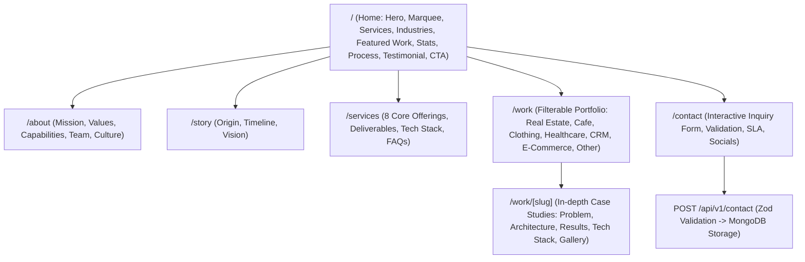

# The Angaar Labs — Master Implementation Blueprint
> **Vibe Coding Hackathon | Problem Statement 04**  
> **Domain**: Flagship Agency / AI-First Web Engineering Studio  
> **Core Focus**: World-Class UI, 60fps Motion Design, Responsive Architecture, Resilient Full-Stack Backend  

---

## 1. Executive Summary & Brand Direction

### The "Angaari" Brand Concept
- **Vibe**: Fiery, bold, high-energy, uncompromisingly premium engineering studio.
- **Core Narrative**: *"From AI-native backends to pixel-perfect frontends — we own every layer of the stack. Zero to 100% product execution."*
- **Aesthetic Pillars**:
  - **Base**: Ultra-deep obsidian & charcoal black (`#0C0A09`, `#1A1614`).
  - **Accents**: Molten ember (`#F2660A`), fiery gradient ramps (`#FF8A1E`), gold sparks (`#FACC15`).
  - **Glow & Depth**: Deep radial ember shadows (`#7C2D1222`), fine cybernetic grid overlays, glassmorphic card surfaces (`backdrop-blur-xl`).
  - **Typography**: Display/Headings with heavy tight-tracking grotesk, body in crisp `Inter`/`Plus Jakarta Sans`, metadata/tags in `JetBrains Mono`.

---

## 2. Evaluation Rubric & Quality Targets (100 Marks + 10 Bonus)

| Criteria | Weight | Implementation Focus |
| :--- | :--- | :--- |
| **Visual Design** | **28 Marks** | Originality, visual hierarchy, consistent spacing tokens, glassmorphism, bespoke ember palette. |
| **Motion & Interaction** | **22 Marks** | Kinetic split-text hero, smooth 60fps Framer Motion scroll reveals, card hover tilt/glow, seamless page transitions. |
| **Completeness** | **12 Marks** | All 7 routes (`/`, `/about`, `/story`, `/services`, `/work`, `/work/[slug]`, `/contact`) with rich, realistic case studies and zero lorem ipsum. |
| **Responsiveness** | **10 Marks** | Flawless mobile (360px) to desktop (4K), full-screen animated mobile navigation overlay, zero horizontal overflow. |
| **Contact & Backend** | **10 Marks** | `POST /api/v1/contact` with Zod client+server validation, MongoDB/Mongoose persistence, status codes, and resilient fallbacks. |
| **Code Quality & Design System**| **8 Marks** | Modular atomic component library (`Button`, `Container`, `SectionHeading`, `Reveal`, `Marquee`, `StatCounter`, `ProjectCard`, `ServiceCard`). |
| **Performance, SEO & A11y** | **5 Marks** | Semantic HTML5, dynamic OpenGraph/Meta tags, keyboard accessibility, high-contrast text, optimized images. |
| **Viva & PROMPTS.md** | **5 Marks** | Thorough architecture documentation, clear viva explanations, prompt logging. |
| **Bonus Features** | **+10 Marks** | Custom magnetic cursor, interactive particle canvas / ember glow, dark/light toggle readiness, dynamic case study slug routing. |

> **Crucial Exam Rule**: Admin functionality (Dashboard/CMS/Auth) is **strictly OUT OF SCOPE** per mentor instructions. All projects and portfolio data will be served dynamically through high-fidelity structured datasets and `/api/v1/projects` endpoints with seed scripts for immediate evaluator inspection.

---

## 3. Information Architecture & Routes



### Route Breakdown

#### 1. `/` — Home (The Show-Stopping Landing Experience)
- **Signature Hero**: Kinetic typography headline reveal (*"We Engineer Scalable AI-Powered Software Systems"*), glowing ember particle background, dual magnetic CTAs (*"Start a Project"*, *"Explore Work"*), client proof chips.
- **Trusted / Industry Marquee**: Infinite smooth scrolling ticker with leading brands and technology partners.
- **Capabilities Bento-Grid**: Interactive hover cards detailing Agentic AI, Full-Stack SaaS, Enterprise Dashboards, and Cloud Systems.
- **Industry Verticals Grid**: E-commerce, FinTech, HealthTech, Real Estate, Food & Hospitality, Legal AI.
- **Featured Case Studies**: 3-4 flagship projects with parallax hover, live metrics, tech badges, and direct case study links.
- **Why Us & Animated Stat Counters**: Interactive counters (40+ Systems Shipped, 99.9% Uptime, <100ms LLM Latency, 100% Project Delivery).
- **4-Stage Engineering Process**: Discover $\rightarrow$ Architect $\rightarrow$ Build $\rightarrow$ Launch with scroll-activated step lines.
- **Standout Testimonials**: Verified client reviews and quotes.
- **High-Impact Closing CTA**: Fiery gradient action banner routing to `/contact`.

#### 2. `/about` — Agency Identity & Culture
- Studio manifesto & engineering philosophy.
- Core Values (Architectural Integrity, Zero Fluff, Extreme Speed, AI-First).
- Leadership & Core Team Cards (with role, avatar, specialties, GitHub/LinkedIn).
- Engineering Culture & Working Principles.

#### 3. `/story` — The Angaar Evolution
- Narrative scroll-timeline tracking origins from high-stakes hackathon roots to modern enterprise AI studio.
- Key milestones, breakthrough systems, and 2026+ vision for autonomous AI agents.

#### 4. `/services` — Comprehensive Capabilities Matrix
- 8 Deep-Dive Service Cards:
  1. Agentic AI & Multi-Agent Pipelines
  2. Full-Stack Web Systems (Next.js / Node.js)
  3. Multi-Tenant SaaS Platforms
  4. Enterprise Real-Time Dashboards
  5. High-Performance Mobile Applications
  6. AI Automation & Workflow Orchestration
  7. Cloud Infrastructure & DevOps (AWS / GCP / K8s)
  8. Custom Enterprise Software & Internal Tooling
- Detailed Deliverables, Architecture Stack, SLA, and Interactive FAQ accordion.

#### 5. `/work` & `/work/[slug]` — Portfolio & Case Studies
- **`/work`**: Dynamic category filter buttons (*All, Real Estate, Cafe/Hospitality, Clothing, Healthcare, CRM/Enterprise, E-Commerce, AI Systems*).
- **`/work/[slug]`**: Rich case studies featuring:
  - Project Hero with live site preview badge
  - Client profile & Industry vertical
  - The Problem / Legacy Bottlenecks
  - The Architectural Solution (Agent pipelines, schema design, tech highlights)
  - Measurable KPIs & Results (e.g. 4.8x Conversion, 65% Latency Drop)
  - Interactive Visual Gallery
  - Tech Stack Pill Badges
  - Previous / Next project pagination links

#### 6. `/contact` — High-Conversion Inquiry Engine
- Two-column split layout:
  - **Left**: Studio direct contacts, 4-hour SLA guarantee, Calendly quick booking, office location.
  - **Right**: Form fields for `Name`, `Email`, `Company`, `Budget Range`, `Service Required`, `Project Message`.
  - Client-side real-time Zod validation, inline error messages, interactive loading state, animated success modal/banner.

---

## 4. Design System Tokens (`"angaari"` Palette)

```css
:root {
  /* Color Palette */
  --color-base: #0C0A09;        /* Deep Charcoal Base */
  --color-surface: #1A1614;     /* Card & Panel Surface */
  --color-surface-hover: #26201C;
  --color-ember: #F2660A;       /* Primary Action Accent */
  --color-flame: #FF8A1E;       /* Secondary Gradient Ramp */
  --color-gold: #FACC15;        /* Spark / Highlight Accents */
  --color-ember-glow: #7C2D12;  /* Deep Ambient Shadow */
  --color-smoke-white: #F5F5F4; /* High-Contrast Headings */
  --color-ash: #A8A29E;         /* Secondary / Muted Text */
  --color-border: rgba(242, 102, 10, 0.15);
  --color-border-hover: rgba(242, 102, 10, 0.45);

  /* Spacing Scale */
  --space-unit: 8px; /* 8-pt grid system */

  /* Radii */
  --radius-sm: 8px;
  --radius-md: 14px;
  --radius-lg: 20px;
  --radius-full: 9999px;

  /* Shadows & Glows */
  --shadow-ember: 0 0 25px -5px rgba(242, 102, 10, 0.35);
  --shadow-ember-lg: 0 0 50px -10px rgba(242, 102, 10, 0.45);
}
```

---

## 5. Backend, Database & API Specifications

### API Endpoints
Base URL: `/api/v1`

#### `POST /api/v1/contact`
- **Access**: Public
- **Request Headers**: `Content-Type: application/json`
- **Request Body (Zod Validated)**:
```json
{
  "name": "Rahul Mehta",
  "email": "rahul@cafedelight.in",
  "company": "Cafe Delight",
  "budget": "50k-1L",
  "service": "Website + Ordering",
  "message": "Need a high-performance modern website and table booking system for our new cafe."
}
```
- **Response `201 Created`**:
```json
{
  "success": true,
  "message": "Thanks! We've received your enquiry and will get back within 24 hours.",
  "data": {
    "id": "6702ff94a8c2d14e",
    "createdAt": "2026-10-01T11:45:00.000Z"
  }
}
```
- **Response `400 Bad Request`**:
```json
{
  "success": false,
  "error": {
    "code": "VALIDATION_ERROR",
    "message": "Validation failed on submitted fields",
    "details": [
      { "path": "email", "message": "A valid business email is required" }
    ]
  }
}
```

#### `GET /api/v1/projects`
- Returns all published portfolio case studies with category filtering and pagination parameters (`?industry=CRM&featured=true`).

#### `GET /api/v1/projects/:slug`
- Returns comprehensive case study payload for a given slug.

### MongoDB Schema (`Enquiry`)
```typescript
interface IEnquiry {
  name: string;
  email: string;
  company?: string;
  budget: string;
  service: string;
  message: string;
  status: "NEW" | "READ" | "REPLIED" | "ARCHIVED";
  createdAt: Date;
}
```

---

## 6. Comprehensive Folder Structure

```text
/
├── .env.example                     # Environment template (MONGODB_URI, etc.)
├── IMPLEMENTATION.md                # This Master Architecture & Reference Spec
├── PROMPTS.md                       # Running log of prompt engineering steps
├── README.md                        # Final submission documentation
├── package.json
├── tailwind.config.ts               # Custom tokens, animations, ember shadows
├── tsconfig.json
├── src/
│   ├── app/
│   │   ├── layout.tsx               # Root Layout with Font imports, Navbar, Footer
│   │   ├── page.tsx                 # Home (/)
│   │   ├── not-found.tsx            # Custom 404 Error Page
│   │   ├── about/
│   │   │   └── page.tsx             # About Us (/about)
│   │   ├── story/
│   │   │   └── page.tsx             # Studio Story & Timeline (/story)
│   │   ├── services/
│   │   │   └── page.tsx             # Services Deep-Dive (/services)
│   │   ├── work/
│   │   │   ├── page.tsx             # Filterable Portfolio Grid (/work)
│   │   │   └── [slug]/
│   │   │       └── page.tsx         # In-Depth Case Study (/work/[slug])
│   │   ├── contact/
│   │   │   └── page.tsx             # Contact Engine (/contact)
│   │   └── api/
│   │       └── v1/
│   │           ├── contact/
│   │           │   └── route.ts     # POST Contact Endpoint
│   │           └── projects/
│   │               ├── route.ts     # GET Projects
│   │               └── [slug]/
│   │                   └── route.ts # GET Project Case Study
│   ├── components/
│   │   ├── ui/
│   │   │   ├── Button.tsx
│   │   │   ├── Container.tsx
│   │   │   ├── SectionHeading.tsx
│   │   │   ├── Reveal.tsx
│   │   │   ├── Marquee.tsx
│   │   │   ├── StatCounter.tsx
│   │   │   ├── Badge.tsx
│   │   │   ├── CustomCursor.tsx
│   │   │   └── Card.tsx
│   │   ├── layout/
│   │   │   ├── Navbar.tsx
│   │   │   ├── Footer.tsx
│   │   │   └── MobileMenu.tsx
│   │   ├── sections/
│   │   │   ├── HeroSection.tsx
│   │   │   ├── MarqueeSection.tsx
│   │   │   ├── ServicesGrid.tsx
│   │   │   ├── IndustryShowcase.tsx
│   │   │   ├── FeaturedWork.tsx
│   │   │   ├── StatsSection.tsx
│   │   │   ├── ProcessTimeline.tsx
│   │   │   ├── TestimonialsSection.tsx
│   │   │   └── CTASection.tsx
│   │   ├── work/
│   │   │   ├── ProjectCard.tsx
│   │   │   └── ProjectFilter.tsx
│   │   └── contact/
│   │       └── ContactForm.tsx
│   ├── lib/
│   │   ├── db.ts                    # Cached Mongoose connection with fallback
│   │   ├── utils.ts                 # ClassName merger (cn)
│   │   ├── validations.ts           # Zod schema definitions
│   │   └── data/
│   │       ├── projects.ts          # Rich project data repository
│   │       ├── services.ts          # Full service specifications
│   │       ├── testimonials.ts      # Client feedback data
│   │       └── team.ts              # Studio founders & engineers
│   └── models/
│       ├── Enquiry.ts               # Mongoose Enquiry Model
│       └── Project.ts               # Mongoose Project Model (for seed/API)
```

---

## 7. 5-Member Team Division of Work

| Member | Focus Domain | Deliverables |
| :--- | :--- | :--- |
| **Member 1** | **Core Architecture & UI System** | `tailwind.config.ts`, `globals.css`, `ui/*` (`Button`, `Container`, `Reveal`, `Marquee`, `StatCounter`), `layout/*` (`Navbar`, `Footer`, `MobileMenu`, `CustomCursor`). |
| **Member 2** | **Homepage Experience & Hero** | `app/page.tsx`, `HeroSection.tsx`, `ServicesGrid.tsx`, `IndustryShowcase.tsx`, ember canvas / particle glow. |
| **Member 3** | **Portfolio & Case Studies** | `app/work/page.tsx`, `app/work/[slug]/page.tsx`, `projects.ts`, `ProjectCard.tsx`, `ProjectFilter.tsx`. |
| **Member 4** | **Narrative Pages & Social Proof** | `app/about/page.tsx`, `app/story/page.tsx`, `app/services/page.tsx`, `ProcessTimeline.tsx`, `TestimonialsSection.tsx`, `CTASection.tsx`. |
| **Member 5** | **Contact Backend, Validation & DB** | `app/contact/page.tsx`, `ContactForm.tsx`, `api/v1/contact/route.ts`, `validations.ts`, `db.ts`, `Enquiry.ts`. |

---

## 8. Incremental 6-Milestone Execution Plan

- [ ] **Milestone 1 — Scaffolding & Design Foundation**: Next.js App Router initialization, Tailwind configuration with ember tokens, base CSS, fonts, and core UI primitives.
- [ ] **Milestone 2 — Global Layout & Navigation**: Glassmorphic Navbar with active state indicator, mobile full-screen navigation overlay, rich Footer, and custom cursor.
- [ ] **Milestone 3 — The Signature Homepage (`/`)**: Kinetic typography Hero, logo marquee, bento services, industry grid, featured work cards, stats counter, 4-step process, testimonials, and CTA.
- [ ] **Milestone 4 — Portfolio & In-Depth Case Studies (`/work`, `/work/[slug]`)**: Category-filterable work gallery and dynamic case studies with rich architectural narratives.
- [ ] **Milestone 5 — Brand Story & Services (`/about`, `/story`, `/services`)**: Company manifesto, timeline storytelling, and comprehensive services matrix.
- [ ] **Milestone 6 — Contact Subsystem & Backend Persistence (`/contact`, `POST /api/v1/contact`)**: Form UI with Zod validation, loading/success/error states, MongoDB persistence, and graceful fallback.
- [ ] **Milestone 7 — Quality Assurance, Performance & Submission Packaging**: Responsive audit (360px–4K), SEO metadata, `.env.example`, `PROMPTS.md`, and `README.md`.
